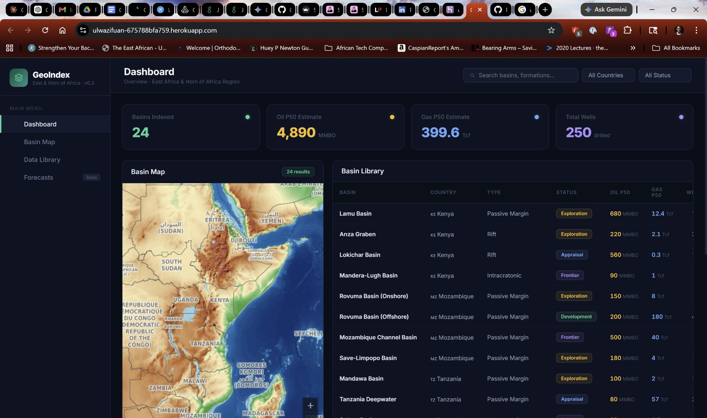

# GeoIndex

**Geological basin data explorer for East Africa & the Horn of Africa.**

A searchable, interactive dashboard for indexing publicly available geological data, visualizing sedimentary basins, and tracking hydrocarbon resource estimates across the region.



## Live Demo

**[ulwazifuan.herokuapp.com](https://ulwazifuan-675788bfa759.herokuapp.com/)**

## What It Does

GeoIndex compiles geological survey data from public sources (USGS assessments, national petroleum authorities, operator disclosures) into a single searchable interface. The current dataset covers **24 sedimentary basins** across **7 countries**: Kenya, Tanzania, Mozambique, Ethiopia, Somalia, Eritrea, and Rwanda.

For each basin, the app tracks:

- **Probabilistic resource estimates** — P90/P50/P10 for recoverable oil (MMBO) and gas (Tcf)
- **Geological metadata** — basin type, key formations, play types, depth ranges
- **Exploration status** — Frontier, Exploration, Appraisal, or Development
- **Well activity** — total wells drilled, discovery year

The interactive map displays all of Africa using real country boundaries from [Natural Earth](https://www.naturalearthdata.com/) 110m data, with basin markers color-coded by exploration status and sized by basin area.

## Features

- **Interactive SVG map** with pan, zoom, and click-to-select basin markers
- **Searchable basin library** — filter by country, exploration status, or free-text search across basin names, formations, and play types
- **Detail drawer** with probabilistic resource bars, formation tags, and analyst notes
- **KPI summary cards** showing aggregate oil, gas, and well counts across filtered results
- **Real cartography** — 53 country polygons traced from Natural Earth vector data

## Tech Stack

- **Frontend:** React (single-file JSX), pure SVG map with manual Mercator projection
- **Build:** Vite
- **Server:** Express (static file serving)
- **Hosting:** Heroku
- **Map Data:** Natural Earth 110m Admin 0 Countries (GeoJSON)
- **Basin Data:** USGS, NOCK, TPDC, INP Mozambique, operator filings

## Getting Started

```bash
git clone https://github.com/RedSonAzriel/geoindex.git
cd geoindex
npm install
npm run dev
```

Open `http://localhost:5173` to view the app locally.

### Production Build

```bash
npm run build
npm start
```

Serves the production build at `http://localhost:3000`.

### Deploy to Heroku

```bash
heroku login
heroku create your-app-name
git push heroku main
heroku open
```

## Data Sources

| Source | Coverage |
|--------|----------|
| USGS World Energy Assessments | Basin-level resource estimates (P90/P50/P10) |
| Kenya National Oil Corporation (NOCK) | Kenya basin data, well counts |
| Tanzania Petroleum Development Corp (TPDC) | Tanzania basin and discovery data |
| Instituto Nacional de Petr&oacute;leo (INP) Mozambique | Mozambique basin licensing data |
| Ethiopian Ministry of Mines | Ogaden Basin, Calub/Hilala field data |
| Operator disclosures (Tullow, ENI, TotalEnergies, Equinor, etc.) | Field-level recoverable estimates |
| Natural Earth | Country boundary vector data (110m resolution) |

## Roadmap

- [ ] **Data ingestion pipeline** — CSV/JSON upload for new basin datasets
- [ ] **Monte Carlo forecast engine** — volumetric estimation with uncertainty quantification
- [ ] **Tile-based map** — Leaflet/MapLibre integration with satellite imagery
- [ ] **Basin polygon overlays** — actual basin boundary geometries on the map
- [ ] **User accounts & persistence** — save custom basin datasets
- [ ] **API layer** — RESTful endpoints for programmatic access

## License

MIT

## Author

Built by EJ Eziga
